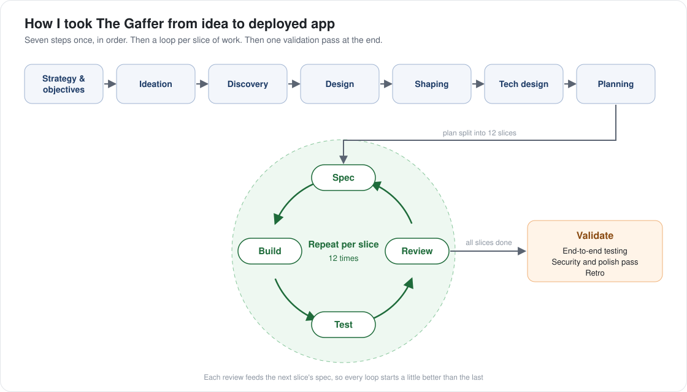

# Project Workflow

*Written September 2026. AI tools change fast, so some details may have dated.*

How I took [The Gaffer](https://github.com/stephenpollock79/fpl-advisor#the-gaffer) from idea to deployed app, and how AI was used at each step.

> **Read this in context.** This is what worked for one product manager who can't code, building solo, on a small personal product. It isn't a template for teams, regulated products or larger codebases. Take the parts that fit your situation and change the rest. For teams, see [Scaling to teams](scaling-to-teams.md).

## Modes of working with AI

Each step used one of four modes, depending on the stakes:

| Mode | Who does the work | Who reviews it |
|---|---|---|
| **1 · Human only** | Human | Another human |
| **2 · AI validation** | Human | AI reviews and helps iterate |
| **3 · Human validation** | AI | Human reviews and helps iterate |
| **4 · Autonomous AI** | AI | AI reviews and iterates on its own |

## Step by step

Each step produces an artefact, and that artefact is the main input to the steps that follow.

| # | Step | How I did it | Artefact | Mode |
|---|---|---|---|---|
| 1 | **Strategy & objectives** | Wrote a standard strategy document: background, core assumptions and objectives. It underpins all the AI-driven work in the steps that follow | Strategy and objectives document | 2 |
| 2 | **Ideation** | Brainstormed a long list of ideas and had AI attack each one from five different user viewpoints. Scored the survivors against pass/fail tests drawn from the strategy document, then had AI research competitors and data sources for the winner | High-level project idea document | 2 |
| 3 | **Discovery** | Defined the problem only, not the solution. The `create-prd-problem-statement` skill drafted it in Claude Cowork from my input and the strategy and ideation documents; the `grill-me` skill then interrogated it in a fresh session, before any design started | PRD (problem section complete) | 3 |
| 4 | **Design** | Briefed Claude Design with the artefacts from the previous steps, plus real app patterns to copy. It produced an 11-screen clickable prototype in about two days; an AI design critique then drove a second version | High-fidelity prototype and design system document | 3 |
| 5 | **Shaping** | The `create-prd-requirements` skill wrote the detailed requirements *from* the prototype, not before it: nine features, each with testable acceptance criteria. A second `grill-me` pass produced a numbered decision log | PRD (requirements section complete) and decision log | 3 |
| 6 | **Tech design** | AI proposed the technical choices (stack, data model, security boundaries) as short decision records. I ruled on the consequences, not the code | Architecture decision records and technical architecture document | 3 |
| 7 | **Planning** | Split the work into 12 slices, each small enough to build in a day or so. Deployed an empty app (hosting, database, login) before building any feature | Build plan, tickets for each slice, and an empty deployed app | 3 |
| ↻ | **Spec** | The `to-spec` skill wrote each slice's spec in Cowork just before building it, after reading the previous slice's review | Slice spec | 4 |
| ↻ | **Build** | Claude Code built the slice against its spec and ticket | Working code for the slice | 4 |
| ↻ | **Test** | Automated tests, each named after the requirement it proves, plus me using it on my phone | Passing tests, plus a list of what isn't covered | 3 |
| ↻ | **Review** | A fresh AI session, with no memory of building it, checked the slice against its spec: what was built but not asked for, what's missing, what was decided silently | Review notes, which feed the next slice's spec | 4 |
| 8 | **Validate** | Tested whole journeys end to end, then ran a security probe (it found public sign-up switched on in production), a polish pass, and a retro | Release-ready app and retro document | 3 |

### What "AI" means in that table

Three different things, and the difference between them is most of the point.

- A **skill** is an instruction file I wrote or adapted that runs the same way every time. The PRD and spec steps are skills, published in full — with where each one was used — in [Skills](skills/README.md).
- A **coding agent** is Claude Code working in the repo against a spec and a ticket, with tests.
- A **fresh session** is a new conversation that sees only the files, and none of the reasoning that produced them. That's the review step, and the isolation is the whole reason it works.

## What went well, and what I'd improve

| Went well | I'd improve |
|---|---|
| **Time spent before coding.** A prototype, then requirements written from that prototype, then a spec for each slice. Requirements drawn from something real were specific, and the build ran with relatively few problems | **Stop sooner on repeat failures.** One feature took eighteen attempts before the wrong assumption behind it was found |
| **The review loop.** Each fresh-eyes review made the next slice's spec better | **Keep human checks human.** If a step needs a person to review it (mode 3), don't let it slide into AI checking itself (mode 4) when time is short |
| **Solo, in under three weeks.** From problem brief to a deployed app with a real database and login | **Set project and AI rules on day one.** Decide how you want to work with AI before you start, not as problems appear |

---

[← Back to the playbook](README.md)
