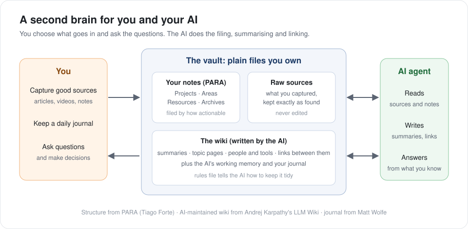

# Second Brain

A second brain is a notes vault that you and your AI share. You decide what goes in and ask the questions. The AI does the filing, summarising and linking. Over time it becomes the AI's long-term memory of your work.

## What it is

Three ideas, borrowed and combined:

| Idea | From | What it does here |
|---|---|---|
| **PARA** | [Tiago Forte](https://fortelabs.com/blog/para/) | Files your own notes by how actionable they are: **P**rojects, **A**reas, **R**esources, **A**rchives |
| **LLM Wiki** | [Andrej Karpathy](https://gist.github.com/karpathy/442a6bf555914893e9891c11519de94f) | You add sources; the AI writes and maintains a wiki of summaries and linked topic pages. It does the upkeep that makes most wikis decay |
| **Grounded journal** | [Matt Wolfe](https://www.youtube.com/watch?v=yke4fLQUsh4) | A daily journal the AI answers from your own notes, not generic advice |

It's all plain markdown files in a folder, so any AI tool can read it and you're never locked in.

## Why it's worth it

| Benefit | What it means |
|---|---|
| **The AI starts from what you know** | Decisions, reasoning and where things live are already written down. No re-explaining every session |
| **Knowledge compounds** | Every source you add gets linked to what's already there, so the vault gets more useful the more you use it |
| **You keep it, whatever the tool** | Plain files you own. Switch AI tools or models and nothing is lost |
| **Low effort to maintain** | The AI does the tedious part: summarising, cross-linking, tidying |

## Watch out for

| Issue | What to do |
|---|---|
| **Over-building** | It's tempting to keep adding folders, automations and rules. Start small and add only when something hurts |
| **Rubbish in, rubbish out** | Feed it strong, focused sources, not everything you've ever saved. Curate, don't dump |
| **Privacy** | The AI can read everything in the folders you connect. Keep passwords, keys and sensitive personal data out |
| **AI summaries can be wrong** | Keep the original sources untouched next to the summaries, so anything important can be checked |
| **Tool limits** | Some AI tools can't delete files, move them or run Git inside a connected folder. Find the limits early and work around them |

## How to set it up

1. **Install [Obsidian](https://obsidian.md)** (free) and create a vault. A vault is just a folder of markdown files.
2. **Add the PARA folders:** `Projects`, `Areas`, `Resources`, `Archives`.
3. **Add the wiki** inside `Resources`: a `raw` folder for sources (never edited) and a `wiki` folder the AI writes.
4. **Write a rules file** (`CLAUDE.md`, or `AGENTS.md` for other tools) that tells the AI how the wiki is organised and what it may and may not touch.
5. **Capture sources** with the [Obsidian Web Clipper](https://obsidian.md/clipper): articles, papers, video transcripts.
6. **Point your AI at the folder** and ask it to ingest what's new. It writes the summaries and links.
7. **Add a journal** (optional): a short daily entry the AI answers from your notes.
8. **Keep it tidy:** schedule regular ingests and a weekly health check, and back the vault up.

For the full build, start with [Karpathy's LLM Wiki](https://gist.github.com/karpathy/442a6bf555914893e9891c11519de94f) and [Matt Wolfe's step-by-step video](https://www.youtube.com/watch?v=yke4fLQUsh4). I used Claude as the AI agent; the pattern works the same with other agents that can read and write files.

---

[← Back to the playbook](README.md)
